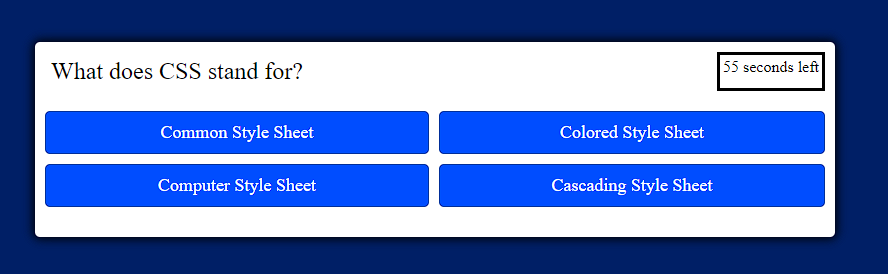

# Guessing_Minigame
Quiz game built for UCI Bootcamp

Acceptance Criteria: 
GIVEN I am taking a code quiz 
WHEN I click the start button 
THEN a timer starts and I am presented with a question 
WHEN I answer a question 
THEN I am presented with another question 
WHEN I answer a question incorrectly 
THEN time is subtracted from the clock 
WHEN all questions are answered or the timer reaches 0 
THEN the game is over 
WHEN the game is over 
THEN I can save my initials and score

In this quiz game the user is given mulitple choices to a single question multiple times within one minute.  
The user will be able to submit their score and remaining time to local storage when the quiz is completed or if the timer runs out.

<a href="https://matthewchappelle.github.io/Guessing_Minigame/">Check it out here!</a>